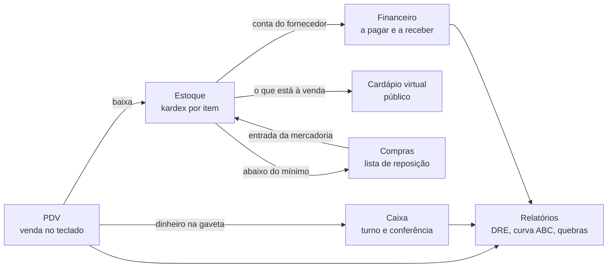

<p align="center">
  
</p>

<h1 align="center">Sistema Cantina</h1>

<p align="center">
  <strong>O balcão inteiro numa tela só.</strong><br>
  PDV operado no teclado, caixa que fecha certo, estoque que baixa sozinho<br>
  e um cardápio virtual que se atualiza a cada venda.
</p>

<p align="center">
  
  
  
  
  
</p>

---

## Por que ele existe

Cantina é um negócio de **fila**. O intervalo dura quinze minutos, e tudo o que
custa três segundos a mais por cliente aparece como uma fila que dobra a
esquina. Este sistema foi construído em cima dessa restrição.

|  | |
| --- | --- |
| ⌨️ **A venda inteira sem tirar a mão do teclado** | Os comandos ficam no bloco numérico, onde a mão do caixa já está. Digita, `Enter`, `Enter`. Sem mouse, sem menu, sem procurar botão. |
| 🧾 **O recibo é uma ficha de retirada** | Quem separa a mercadoria lê de longe: quantidade e nome em corpo grande, dinheiro em corpo pequeno. Foi desenhado para o pico, não para o arquivo. |
| 📱 **Cardápio virtual que ninguém precisa manter** | Um endereço público com foto, preço e quantidade disponível. Sai do próprio estoque: vendeu, o cardápio já sabe. |
| 🔒 **Cada operador enxerga o próprio turno** | A quebra de caixa de um não é conversa do outro. Fechou o turno, aquilo vira histórico da gerência. |
| 💸 **Roda numa máquina gratuita** | SQLite, um processo, HTTPS automático e backup diário. Três operadores simultâneos sem suar. |

### Veja funcionando

| | |
| --- | --- |
| **Cardápio público** | <https://maanaimcantina.duckdns.org> |
| **Sistema** | <https://app.maanaimcantina.duckdns.org> (precisa de login) |

---

## O que tem dentro



Roda no navegador do PC (sistema completo) e no do celular, onde todos os módulos
continuam **editáveis** — inclusive fazer estoque pelo celular. A interface muda por
**aparelho**, e não por largura de janela: um celular pedindo "solicitar site para
computador" recebe a versão de computador, e uma janela estreita no desktop continua
sendo desktop.

| Camada | Tecnologias |
| --- | --- |
| Frontend | React 19, TypeScript, Vite, Tailwind CSS v4, React Router, Recharts, Axios |
| Backend | Python 3, FastAPI, SQLAlchemy 2, Pydantic v2, JWT (bcrypt) |
| Banco | SQLite (arquivo `backend/cantina.db`) |
| Servidor | Caddy (HTTPS automático) + systemd, numa VM Ubuntu |
| Integrações | PIX (BR Code), ApiBrasil (CNPJ/CEP) com fallback para BrasilAPI e ViaCEP |

---

## Estrutura de pastas

```
Sistema cantina/
├── backend/
│   ├── app/
│   │   ├── core/           config, banco, segurança (JWT/bcrypt), dependências
│   │   ├── models/         modelos ORM (tabelas e enums)
│   │   ├── schemas/        contratos de entrada/saída da API (Pydantic)
│   │   ├── routers/        endpoints por módulo
│   │   │   ├── auth.py          login e sessão
│   │   │   ├── funcionarios.py  equipe e perfis de acesso
│   │   │   ├── parceiros.py     clientes e fornecedores
│   │   │   ├── estoque.py       categorias, produtos, movimentações
│   │   │   ├── vendas.py        PDV
│   │   │   ├── caixa.py         caixas, turnos, sangria e fechamento
│   │   │   ├── compras.py       lista de reposição e relatório do comprador
│   │   │   ├── financeiro.py    contas a pagar e a receber
│   │   │   ├── relatorios.py    dashboard, DRE, curva ABC
│   │   │   ├── pix.py           chave PIX e BR Code da venda
│   │   │   ├── configuracoes.py ajustes do recibo impresso
│   │   │   ├── publico.py       cardápio virtual (única rota sem login)
│   │   │   └── integracoes.py   consulta de CNPJ e CEP
│   │   ├── services/       regras de negócio (estoque, caixa, documentos, APIs)
│   │   └── main.py         aplicação FastAPI
│   ├── migracoes/          migrações do banco (Alembic)
│   │   └── versions/       uma migração por mudança de schema
│   ├── seed.py             dados de demonstração
│   ├── dados_teste.py      volume de teste sobre o banco atual
│   ├── alembic.ini
│   ├── requirements.txt
│   └── .env.example
├── frontend/
│   └── src/
│       ├── components/     Layout (sidebar + barra inferior) e biblioteca de UI
│       ├── lib/            cliente HTTP, autenticação, formatação, tipos
│       └── pages/          uma página por módulo
├── marca/                  origem do logo e scripts que geram os arquivos da marca
├── scripts/                preparar, iniciar, parar, migrar, recriar-banco (Windows)
└── deploy/                 subir num servidor Linux: Caddy, systemd, backup e cardápio
```

---

## Como rodar

Os scripts em `scripts/` cuidam de tudo (cada `.ps1` tem um `.bat` para dois cliques):

```powershell
cd scripts
.\preparar.ps1 -ComDemo   # uma vez: dependencias, .env e banco de exemplo
.\iniciar.ps1             # sobe backend + frontend e abre o navegador
```

O `iniciar` imprime os endereços — incluindo o do celular na mesma rede — e
encerra os dois serviços com Ctrl+C. Detalhes e solução de problemas em
[scripts/README.md](scripts/README.md).

<details>
<summary>Rodando na mão, sem os scripts</summary>

```bash
# backend
cd backend
python -m venv .venv
.venv/Scripts/python -m pip install -r requirements.txt
cp .env.example .env
.venv/Scripts/python seed.py          # opcional: dados de demonstração
.venv/Scripts/python -m uvicorn app.main:app --reload --host 0.0.0.0 --port 8000

# frontend (outro terminal)
cd frontend
npm install
npm run dev
```

</details>

API em <http://localhost:8000> · documentação interativa em <http://localhost:8000/docs>.
Sistema em <http://localhost:5173>. O Vite já faz proxy de `/api` para o backend.

### Acessos de demonstração

O login é um nome curto, sem e-mail — a ferramenta é de uso interno.

O administrador nasce no primeiro boot com o usuário definido em
`ADMIN_USUARIO` (padrão `admin`). A senha vem de `ADMIN_PASSWORD`; **sem ela
definida, o sistema sorteia uma e a mostra uma única vez no log da subida** —
procure por `[setup] Senha sorteada` no console ou no `journalctl`.

Senha nenhuma fica escrita aqui nem no código: credencial em repositório é
credencial pública, e este README já esteve num sistema publicado na internet.

O `seed.py` e o `dados_teste.py` criam operadores de demonstração com senha
**sorteada a cada execução**, mostrada ao final. São contas de teste: desative-as
em Funcionários antes de a cantina entrar em uso.

### Acesso pelo celular

Backend e frontend sobem escutando na rede local, e o `iniciar.ps1` já mostra o
endereço pronto. Basta abri-lo no celular, com ele no mesmo Wi-Fi.

---

## Módulos e como eles se conectam

* **Ponto de venda** — feito para ser operado **só com o teclado**, com os comandos no
  bloco numérico: a busca nunca perde o foco, `Enter` adiciona e `Enter` com a busca
  vazia fecha a venda. Recebe em **dinheiro** (com troco e sugestões de cédula) e **PIX**
  (com QR Code do valor exato). Exige um caixa aberto pelo operador logado: sem turno,
  não há venda. Ao finalizar, dá baixa no estoque — um movimento por item, com o saldo
  conferido pelo próprio banco. O cancelamento devolve os itens.
* **Cardápio virtual** — um endereço público, separado do sistema, com o que está à venda
  agora: foto, preço e quantidade disponível, agrupados por categoria, e o esgotado
  marcado em vez de escondido. Sai do próprio estoque; a foto se cadastra junto do
  produto. É vitrine: não há carrinho, pedido nem qualquer rota de escrita.
* **Configurações** — a chave PIX que recebe o dinheiro (conferida antes de salvar, com
  um QR de teste de R$ 1,00 para o gerente ler no banco) e o recibo impresso: logo,
  cabeçalho, rodapé e prévia em tamanho real do papel.
* **Caixa** — vários terminais, cada um com a sua gaveta. O operador abre o turno com o
  fundo de troco, lança sangria e suprimento e fecha contando o dinheiro; o sistema
  compara com o esperado (`abertura + vendas em dinheiro + suprimentos − sangrias`) e
  **congela a quebra** naquele turno. PIX não entra na conta: não passa pela gaveta. A
  gerência fecha o turno de quem esqueceu, e fica registrado quem fechou.
* **Estoque** — categorias, produtos e um **kardex**: todo movimento fica gravado com o
  saldo depois dele, o motivo e quem fez. Entrada recalcula o custo médio ponderado e
  pode gerar a conta a pagar do fornecedor. Produto de uso e consumo não vai para o
  balcão. A saída é conferida pelo próprio banco, numa instrução só — dois caixas não
  vendem a mesma última unidade.
* **Compras** — sugere o que está no mínimo ou abaixo, com a quantidade que recompõe o
  estoque, e vira uma lista ajustável à mão. O relatório sai agrupado por fornecedor,
  pronto para mandar no WhatsApp. Na volta, a conferência da entrega dá entrada só da
  diferença: conferir de novo não duplica mercadoria.
* **Financeiro** — contas a pagar e a receber, com parcelamento, baixa total ou parcial
  e um resumo de vencidos e a vencer.
* **Relatórios** — painel do dia, vendas por dia, produtos mais vendidos, DRE
  simplificado, curva ABC, recebimento por forma de pagamento e **quebras de caixa por
  operador**. Todo recorte respeita o relógio da cantina, não o do servidor.
* **Cadastros e equipe** — clientes e fornecedores numa ficha só (CPF/CNPJ validado, com
  consulta automática de CNPJ e CEP), e funcionários com perfil de acesso — sem deixar
  ninguém trancar o próprio acesso nem derrubar o último administrador.

### Atalhos do PDV

O PDV abre em repouso: nada acontece antes de o operador abrir uma venda. Os comandos
ficam no bloco numérico e nas teclas vizinhas, que é onde a mão do caixa já está — e
cada atalho é também um botão na barra, para quem prefere o mouse.

**Tela inicial**

| Tecla | O que faz |
| --- | --- |
| `Enter`, `+` ou `N` | Nova venda, com o carrinho zerado |
| `/` ou `L` | Localizar uma venda do turno |
| `*` ou `P` | Consultar produtos e preços |

**Durante a venda** — com texto digitado as teclas escrevem; com a busca vazia, viram
comando.

| Tecla | O que faz |
| --- | --- |
| digitar | Busca por nome ou código (a lista só aparece a partir da primeira letra) |
| `↑` `↓` `←` `→` | Navega entre os resultados |
| `Enter` | Abre a quantidade do produto destacado |
| `Enter` ou `Espaço` (busca vazia) | Finaliza a venda |
| `+` `−` (busca vazia) | Soma ou tira uma unidade do produto destacado |
| `Backspace` (busca vazia) | Tira o último item |
| `/` (busca vazia) | Localizar venda · `*` consultar produtos |
| `Esc` | Limpa a busca; com tudo vazio, sai para a tela inicial |

**Definindo a quantidade** — ao escolher o produto abre um passo com a quantidade em
destaque: `↑` `↓` ou `+` `-` ajustam, digitar troca direto, `Enter` confirma e `Esc`
cancela. Escolher um produto **que já está na venda** abre esse passo com a quantidade
atual — é assim que se corrige uma quantidade sem mouse. Zero remove o item. O teto é o
estoque disponível: não se monta um carrinho que o balcão não entrega.

**Recebendo** — o pagamento abre já com o foco na forma: `/` alterna entre dinheiro e
PIX (ou `D` e `P`), `*` volta ao valor exato, `Enter` confirma e `Esc` volta. Terminada
a venda, `Enter` começa a próxima e `I` reimprime o recibo.

### Recebimento

**Dinheiro** — campo do valor recebido com botões de cédula (exato, R$ 20, R$ 50…) e o
troco em destaque. Enquanto faltar dinheiro, o botão de confirmar fica bloqueado.

**PIX** — o sistema gera o BR Code (o "copia e cola") já com o valor da venda e mostra o
QR na tela, mais um botão para copiar o código. Preencha `PIX_CHAVE` no `backend/.env`
para habilitar; sem a chave o PDV continua aceitando PIX, só não desenha o QR.

> O QR **não confirma o pagamento**. Quem confirma é o operador, olhando a notificação do
> banco antes de teclar Enter. Confirmação automática exigiria integração com a API PIX
> do banco (webhook de cobrança).
* **Caixa** — a cantina pode ter **vários caixas** (Caixa 1, Caixa 2, …), cada um com a
  sua gaveta, o seu turno e o seu fechamento. Um caixa comporta um turno aberto por vez,
  e um operador opera um caixa por vez. Abertura com troco inicial, **sangria**
  (retirada), **suprimento** (reforço) e fechamento, onde o valor contado é comparado ao
  esperado e a **quebra de caixa** fica registrada com data e responsável. A conta é
  sempre `abertura + vendas em dinheiro + suprimentos − sangrias`, por gaveta; PIX,
  cartão e fiado ficam de fora porque não passam por ela. A gerência acompanha os turnos
  abertos, pode fechar o turno de quem esqueceu (fica registrado quem fechou) e reabrir
  turnos fechados por engano.
* **Estoque** — produtos, categorias, saldo, estoque mínimo, custo médio ponderado e
  kardex completo. Entradas, saídas, perdas e ajuste de inventário. Uma entrada de
  compra pode **gerar a conta a pagar** do fornecedor automaticamente.
  O produto é **final** (vai ao PDV) ou de **uso e consumo** (farinha, ketchup,
  embalagem: controlado e comprado, mas não vendido).
* **Contas a pagar / a receber** — títulos com parcelamento, baixa total ou parcial,
  cancelamento e destaque de vencidos.
* **Compras** — monta a lista de reposição e gera o relatório para quem vai comprar.
  A sugestão automática traz tudo o que está no mínimo ou abaixo, com a quantidade que
  recompõe o estoque; o relatório sai agrupado por fornecedor, pronto para mandar no
  WhatsApp, baixar em PDF ou imprimir. A lista **não mexe no estoque** — a entrada é
  feita no módulo de estoque quando a mercadoria chegar.
* **Relatórios** — painel, faturamento por dia, **recebimento por forma de pagamento**,
  mais vendidos, DRE simplificado (receita − CMV − despesas pagas), curva ABC e
  **quebras de caixa por operador**. Cada bloco exporta em PDF.
* **Funcionários** — cadastro da equipe e perfis de acesso.
* **Clientes e fornecedores** — cadastro único com preenchimento automático por
  CNPJ e CEP, e limite de crédito usado pelo fiado no PDV. CPF e CNPJ são validados
  pelos dígitos verificadores, no cadastro e na venda.

### Identificação do consumidor na venda

O padrão é **consumidor diverso** — a venda sai sem identificação, que é o caso comum
numa cantina. Digitar um CPF/CNPJ muda isso:

| Situação | O que acontece |
| --- | --- |
| Campo vazio | Consumidor diverso |
| Documento válido, **sem** cadastro | Venda identificada pelo documento, sem criar cadastro |
| Documento válido, **com** cadastro | Vincula o cliente automaticamente e mostra o limite de crédito |
| Documento inválido | Bloqueia a venda com a mensagem do erro |

O fiado é a exceção: exige cliente cadastrado, porque é o cadastro que carrega o limite
de crédito e recebe a conta a receber.

### Perfis de acesso

São dois perfis, e só:

| Perfil | Pode |
| --- | --- |
| `ADMIN` | Tudo |
| `USUARIO` | PDV e caixa (o próprio turno) |

O `USUARIO` entra direto no PDV — os demais módulos não aparecem no menu e as rotas
redirecionam para lá. A restrição vale também na API: os endpoints de gestão respondem
403, e não apenas somem da tela.

**A janela do operador é o turno aberto.** Ele encontra, reimprime e altera as vendas
feitas no caixa que está operando agora; fechado o turno, aquilo vira histórico, e
histórico é da gerência. Vale para a leitura por id também: pedir uma venda ou um turno
de outra pessoa responde 404, e não 403 — distinguir "não existe" de "não é seu"
contaria, número a número, quantas vendas a casa fez.

Cadastrar caixas, cancelar vendas, fechar o turno de outra pessoa e reabrir turnos
continuam sendo ações de administrador.

---

## Integração ApiBrasil

Sem nenhuma configuração o sistema já consulta CNPJ e CEP usando BrasilAPI e ViaCEP.
Para usar a ApiBrasil, preencha no `backend/.env`:

```
APIBRASIL_TOKEN="seu-token"
APIBRASIL_DEVICE_TOKEN="seu-device-token"
```

Com o token preenchido a ApiBrasil vira o provedor principal; se ela falhar ou ficar
indisponível, a consulta cai automaticamente para os provedores públicos.

### Recebimento por forma de pagamento

Quanto entrou em dinheiro e quanto entrou em PIX, com quantidade de vendas, ticket
médio e participação de cada forma, mais o dia a dia empilhado. É o número que fecha
as duas pontas da conferência: **o dinheiro tem que bater com a gaveta, o PIX com o
extrato do banco**.

### Quebras de caixa por operador

Consolida as diferenças dos turnos fechados no período, uma linha por operador:
turnos, quantos fecharam certo, quanto faltou, quanto sobrou, saldo, maior falta e
quanto a falta representa do dinheiro que passou pela gaveta. Abaixo, os turnos de
maior diferença, com a justificativa registrada no fechamento.

Duas escolhas que mudam a leitura:

* **A quebra é de quem operou a gaveta**, não de quem fechou o turno — um gerente
  pode fechar o turno de quem esqueceu, e isso não transfere a diferença para ele.
* **Falta e sobra aparecem separadas.** Quem tem +50 num turno e −50 em outro fecha
  com saldo zero, mas não é o mesmo caso de quem acerta todos os dias; só a coluna
  "fechou certo" distingue os dois.

---

## Segurança

O que está de pé, e por quê:

| Camada | O que faz |
| --- | --- |
| Sessão | Token no `sessionStorage`: fechar o navegador encerra a sessão. No balcão o computador é compartilhado |
| Chave de assinatura | A aplicação **recusa subir** com `SECRET_KEY` vazia, de exemplo ou curta demais |
| Administrador inicial | Sem `ADMIN_PASSWORD`, a senha é sorteada e mostrada uma vez no log |
| Limite por IP | 300 requisições por minuto no geral, **8 no login** — força bruta vira anos em vez de minutos |
| Documentação da API | `/docs` e `/openapi.json` só existem com `DOCS_ABERTAS=true`; fora de desenvolvimento, não |
| Borda (Caddy) | HSTS, CSP, `nosniff`, `X-Frame-Options`, corpo limitado a 1 MB e prazos contra conexão pendurada |
| Entrada | Todo campo de texto tem teto, espelhando a coluna do banco |
| Rota pública | Só o cardápio, e ele devolve campo a campo o que pode ser público — custo, fornecedor e margem ficam do lado de dentro |

---

## Migrações de banco

O schema é versionado com Alembic e **as migrações pendentes são aplicadas
sozinhas ao iniciar** — em uso normal não há nada a fazer. Um banco criado por
versões anteriores (antes do Alembic) é adotado automaticamente na primeira
subida, sem perder dados.

Quando o schema mudar:

```powershell
cd scripts
.\migrar.ps1 criar -Mensagem "descreve a mudanca"   # gera a partir dos modelos
.\migrar.ps1 status                                 # confere a versão
.\migrar.ps1 aplicar                                # aplica
```

Revise o arquivo gerado em `backend/migracoes/versions/` antes de aplicar: o
autogenerate acerta colunas e tabelas novas, mas lê uma renomeação como "apagou
uma coluna e criou outra" — e isso é perda de dados.

---

## Publicar num servidor

Uma VM Ubuntu, dois processos e um comando:

```bash
sudo bash /opt/cantina/deploy/instalar.sh
```

O script instala Python, Node e Caddy, cria o usuário do serviço, monta a tela, sobe a
API no systemd, abre as portas no firewall da máquina, tira o certificado HTTPS e liga
os horários de backup. Roda de novo sem estragar nada. O passo a passo completo — VM,
DNS e as duas regras de entrada da Oracle — está em [deploy/README.md](deploy/README.md).

**Dois endereços no mesmo servidor**: `app.<dominio>` serve o sistema, `<dominio>` serve
o cardápio público. Publicar uma versão nova é outro comando só, que faz backup antes:

```bash
sudo bash /opt/cantina/deploy/atualizar.sh
```

Tudo o que é de ambiente — domínios, chave de assinatura, senha inicial, fuso — mora em
`/etc/cantina.env`, fora do repositório. O SQLite atende bem uma cantina; se um dia o
volume crescer, basta apontar `DATABASE_URL` para PostgreSQL — o SQLAlchemy cobre a troca.

---

<p align="center">
  <sub>Feito para um balcão de verdade, com fila de verdade.</sub>
</p>
